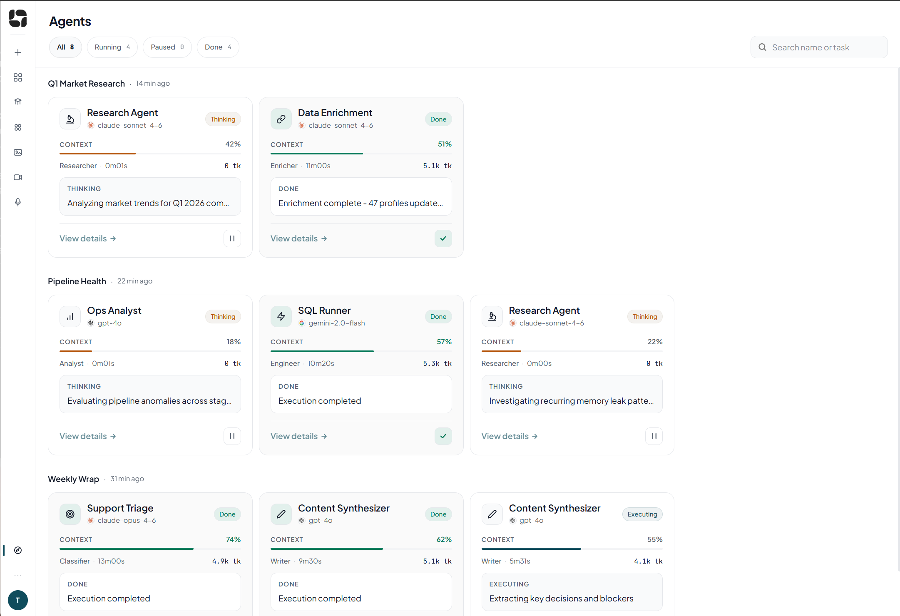
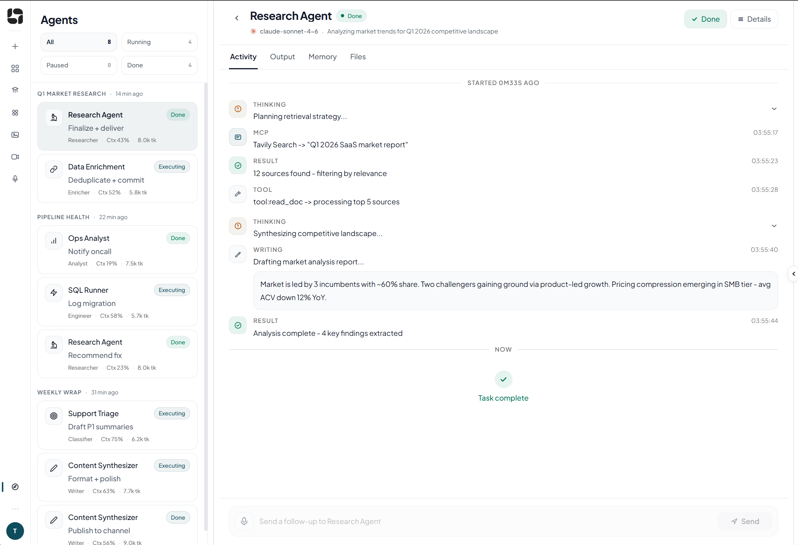
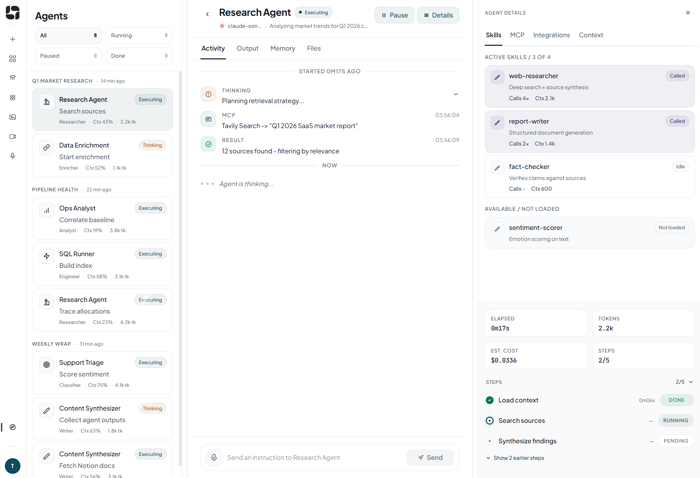

# TESS Command Center

> A multi-agent monitoring interface built as a design & engineering challenge for Tess AI.

<table>
  <tr>
    <td></td>
    <td></td>
    <td></td>
  </tr>
</table>

## How to run

```bash
npm install
npm run dev
```

Open [http://localhost:5173](http://localhost:5173) in your browser.

---

## Visão geral

Este projeto propõe uma interface para o **TESS Command Center**, com foco em acompanhar múltiplos agentes em execução, visualizar atividade em tempo real e permitir inspeção mais detalhada do contexto de cada agente.

Além da parte visual, meu objetivo foi dar à interface uma estrutura mais consistente como produto: menos genérica, mais alinhada à marca da Tess e mais preparada para mostrar informações realmente úteis sobre o trabalho dos agentes.

---

## Ferramentas de IA utilizadas

### Claude
Usei o Claude em diferentes momentos do processo, principalmente como apoio de design e estrutura.

Ele foi usado para:
- criar um **style guide** a partir do CSS overview do site da Tess
- ajudar no **planejamento da estrutura da interface e do código**
- apoiar a **prototipagem de interfaces por partes**
- explorar soluções de layout com base nos tokens extraídos
- refinar partes mais definitivas da interface

O resultado final não veio de uma única geração. Ele foi um **merge de várias explorações**, com ajustes e decisões minhas ao longo do processo.

### Codex
O Codex foi usado principalmente na parte de implementação.

Ele ajudou em:
- boa parte da **implementação**
- **organização do código**
- apoio em **code review**

### Figma Make
Usei o Figma Make para a **prototipagem inicial**, com apoio do modelo Opus, como ponto de partida para explorar uma direção visual inicial.

### GPT
Usei o GPT como apoio mais analítico, principalmente para:
- **análise das telas**
- **criação e refinamento de prompts**
- comparação de alternativas de organização e hierarquia visual

---

## Uma decisão de UX

Uma das principais decisões de UX foi estruturar a interface em **três painéis**, com possibilidade de **fechar** e **redimensionar** áreas conforme a necessidade de foco do usuário.

Essa escolha surgiu porque apenas exibir os agentes e sua atividade não era suficiente. A tela precisava acomodar melhor o que realmente importa em um cenário de agentes de IA: visão geral, atividade em andamento e contexto detalhado. Por isso, organizei a experiência para que o usuário pudesse navegar entre esses níveis sem perder a noção do todo.

Essa estrutura também me permitiu incluir informações mais relevantes para esse tipo de produto, como:
- percentual de contexto utilizado
- atividade por tipo
- MCP, skills e integrations
- tokens e custo
- sinais de alerta, como contexto se aproximando do limite
- variações do que mostrar em cards menores e no painel detalhado

Além disso, pensei em comportamentos de interação que ajudassem a tornar a navegação mais fluida, como o fechamento de um painel quando o redimensionamento indica claramente que ele deixou de ser prioridade. A intenção foi deixar a interface mais adaptável, com mais cara de produto real e menos cara de um conjunto de cards genéricos.

---

## O que eu faria diferente com mais tempo

Com mais tempo, eu refinaria principalmente os seguintes pontos:

- criação de um **dark theme**
- expansão dos estados dos agentes, incluindo:
    - stalled
    - input needed
    - error
    - paused
    - canceled
- refinamento do polimento visual e das **microinterações** no activity feed — estados de loading mais ricos, hierarquia de eventos mais expressiva e passagens de estilo adicionais em banners contextuais e feedback do sistema
- melhor definição de hierarquia entre tipos de evento e feedback do sistema
- banners contextuais e alertas mais refinados
- tooltips mais bem resolvidos onde a interface pede explicação adicional
- interações de terminal mais amigáveis
- tipografia mais coesa em toda a experiência

Também dedicaria mais tempo a revisar a implementação com foco maior em refinamento estrutural. Durante o challenge, meu foco ficou mais concentrado em design, layout e tomada de decisão visual, embora eu tenha mantido atenção à componentização e à organização geral do projeto.

---

## Observações finais

O processo foi bastante iterativo. A solução final veio da combinação de diferentes protótipos e explorações, com curadoria, merge e refinamento para chegar a uma interface mais consistente.

Meu foco não foi apenas cumprir o que estava sendo pedido, mas tentar preencher o que ainda faltava para a experiência parecer mais completa: melhor organização, leitura mais clara dos status, mais contexto útil sobre o trabalho da IA e uma interface com aparência mais sólida como produto da Tess.